# 🧳 FTravex - Smart Tourism App

**FTravex** is a smart tourism mobile application designed to help users discover their ideal travel destinations and hotels — all tailored to their budget and preferences.

---

## 📱 App Screenshots

<p align="center">
  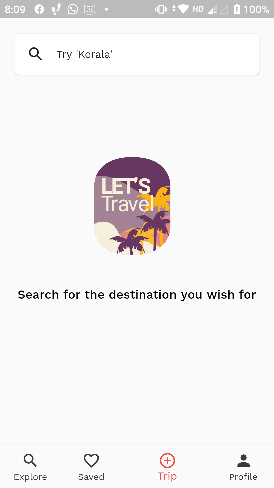
  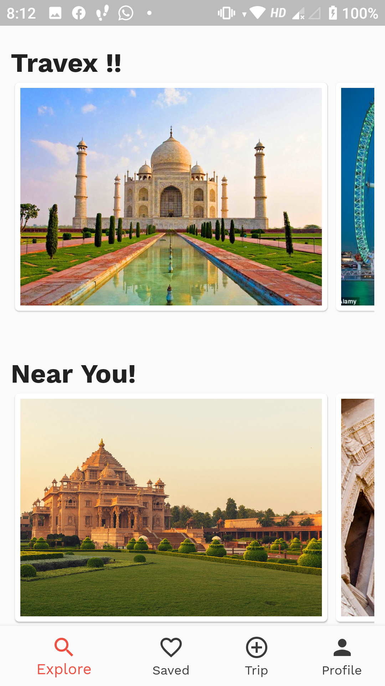
  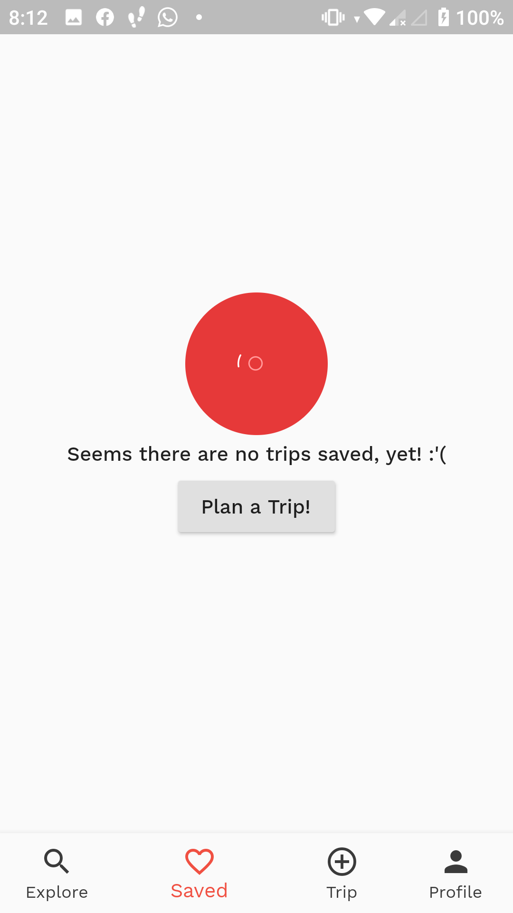
  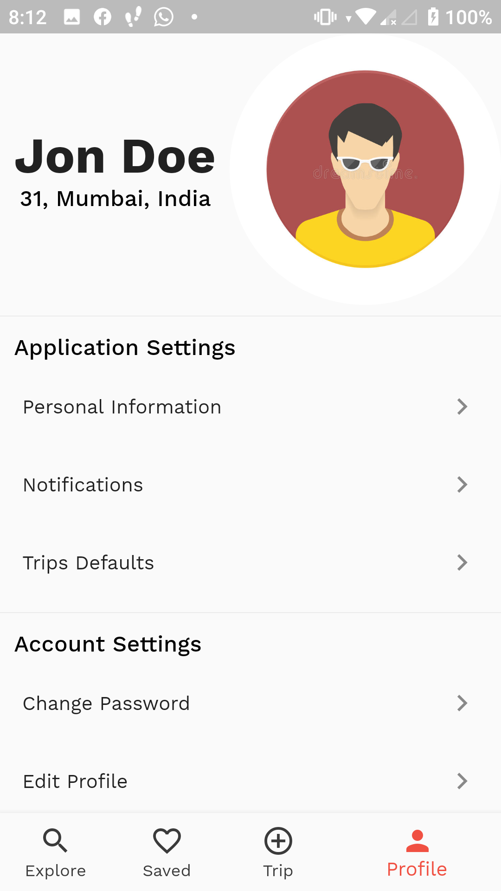
  <br><br>
  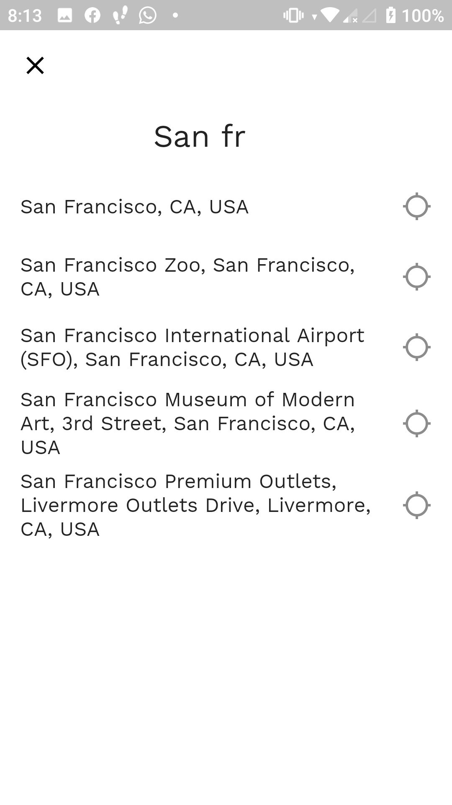
  
  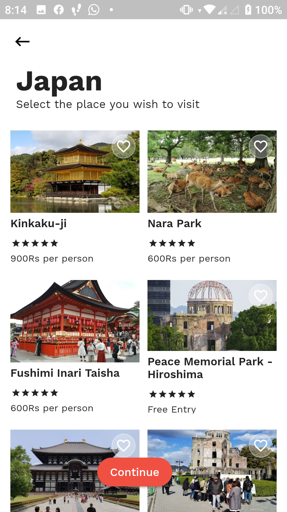
  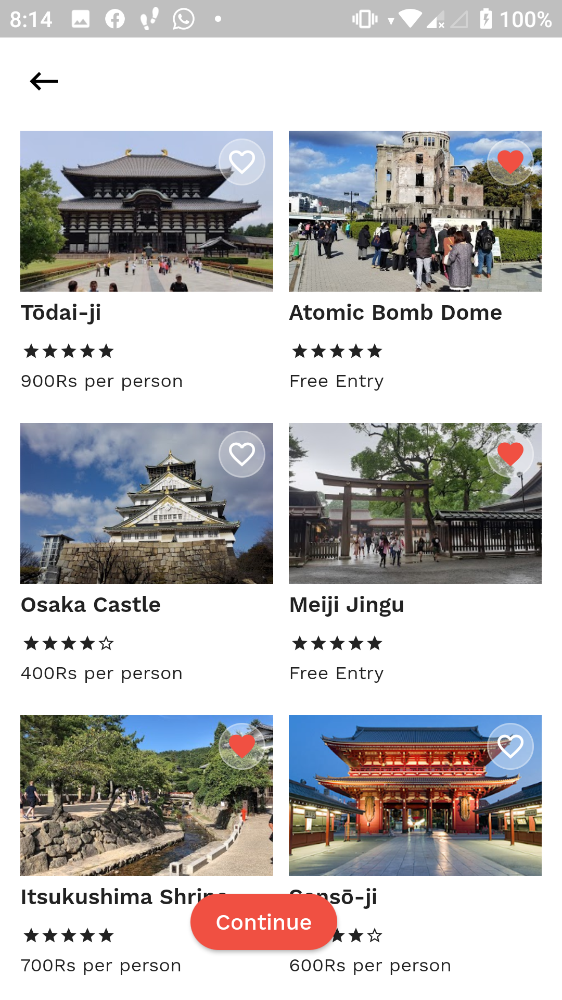
  <br><br>
  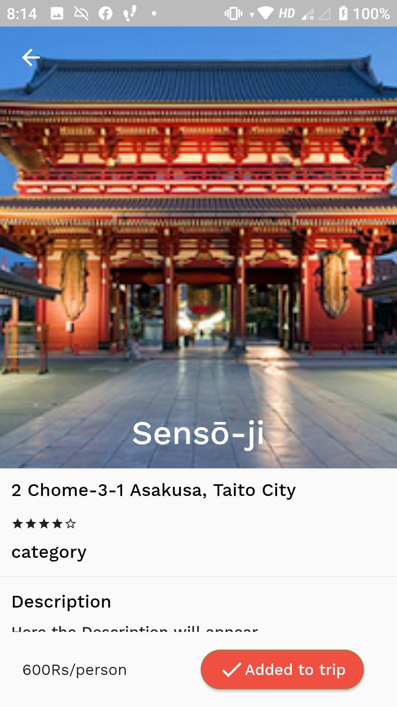
  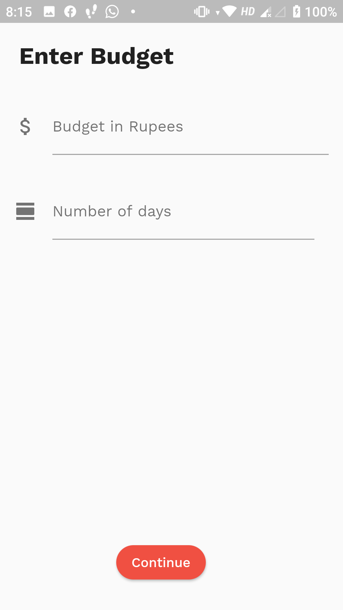
  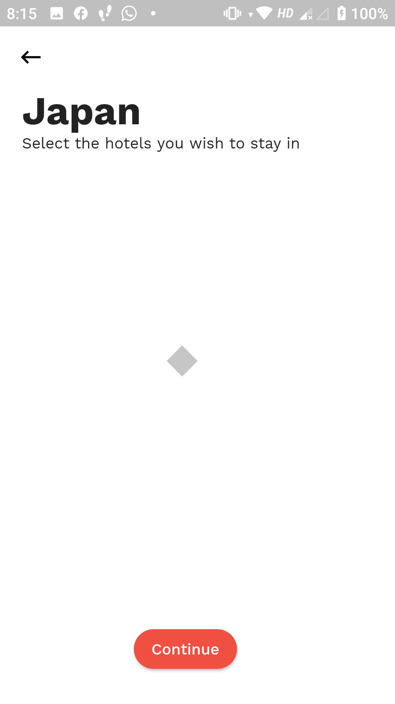
  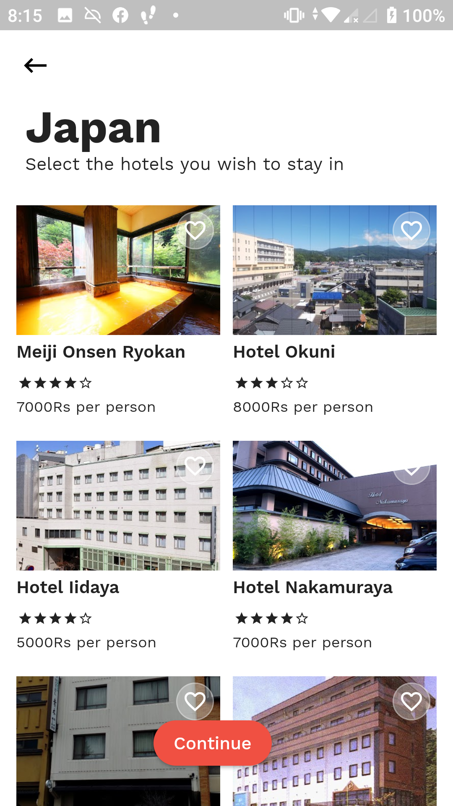
</p>

---

## 🎯 Features

- Personalized destination suggestions based on user preferences
- Hotel recommendations that fit within the user's budget
- Intuitive and clean UI for easy travel planning
- Multi-screen navigation for an immersive experience
- Potential integration with APIs for real-time data *(if applicable)*

---

## ⚙️ Technologies Used

- **Flutter / Android SDK** (Assuming it’s a mobile app — adjust if needed)
- **Dart** / **Java** / **Kotlin** *(depending on the implementation)*
- **Firebase / REST APIs** *(optional — add if used)*

---

## 🚀 Getting Started

### Prerequisites

- Flutter SDK or Android Studio
- Emulator or physical device

### Running the App

```bash
# Clone the repository
git clone https://github.com/your-username/ftravex.git
cd ftravex

# Get dependencies
flutter pub get

# Run the app
flutter run
